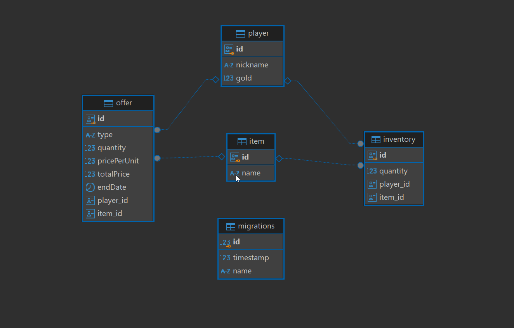

# MMORPG-Marketplace-API

## Tabela de Conteúdos

-   [Visão Geral](#2-visão-geral)
-   [Diagrama ER](#2-diagrama-er)
-   [Início Rápido](#3-início-rápido)
    -   [Instalando Dependências](#31-instalando-dependências)
    -   [Variáveis de Ambiente](#32-variáveis-de-ambiente)
    -   [Migrations](#33-migrations)
-   [Endpoints](#4-endpoints)

---

## 1. Visão Geral

Visão geral do projeto, um pouco das tecnologias usadas.

-   [NodeJS](https://nodejs.org/en/)
-   [Express](https://expressjs.com/pt-br/)
-   [TypeScript](https://www.typescriptlang.org/)
-   [PostgreSQL](https://www.postgresql.org/)
-   [TypeORM](https://typeorm.io/)

A URL base da aplicação:
https://localhost:5000/

---

## 2. Diagrama ER

[ Voltar para o topo ](#tabela-de-conteúdos)

Diagrama ER da API definindo bem as relações entre as tabelas do banco de dados.



---

## 3. Início Rápido

[ Voltar para o topo ](#tabela-de-conteúdos)

### 3.1. Instalando Dependências

Clone o projeto em sua máquina e instale as dependências com o comando:

```shell
npm i
```

### 3.2. Variáveis de Ambiente

Em seguida, crie um arquivo **.env**, copiando o formato do arquivo **.env.example**:

```
.env.example .env
```

Configure suas variáveis de ambiente com suas credenciais do Postgres e uma nova database da sua escolha.

### 3.3. Migrations

Execute as migrations com o comando:

```
npm run typeorm migration:run -d src/data-source.ts
```

---

## 4. Endpoints

[ Voltar para o topo ](#tabela-de-conteúdos)

### Índice

-   [Players](#2-player)
    -   [POST - /player](#21-criação-de-Player)
    -   [GET - /player](#22-listando-Players)
    -   [PATCH - /player/:playerId](#23-atualizar-Player-por-id)
    -   [DELETE - /player/:playerId](#24-deletar-Player-por-id)
-   [Item](#3-Item)
    -   [POST - /Item](#31-criação-de-Item)
    -   [GET - /Item](#32-listando-Items)
    -   [PATCH - /Item/:itemId](#33-atualizar-Item-por-id)
    -   [DELETE - /Item/:itemId](#34-deletar-Item-por-id)
-   [Offer](#4-Offer)
    -   [POST - /offer](#41-criação-de-notícias)
    -   [GET - /offer](#42-listando-notícias)
    -   [GET - /offer/:offerId](#43-listando-notícias-por-id)
    -   [PATCH - /offer/:offerId](#44-atualizar-notícias-por-id)
    -   [DELETE - /offer/:offerId](#45-deletar-notícia-por-id)

---

## 2. **Players**

[ Voltar para os Endpoints ](#5-endpoints)

O objeto Player é definido como:

| Campo     | Tipo   | Descrição                        |
| --------- | ------ | -------------------------------- |
| id        | string | Identificador único do player    |
| nickname  | string | O nome do player.                |
| gold      | string | Quantidade de dinheiro do player |
| inventory | array  | Itens do player                  |
| offers    | array  | Ofertas relacionadas ao player   |

### Endpoints

| Método | Rota              | Descrição                                       |
| ------ | ----------------- | ----------------------------------------------- |
| POST   | /player           | Criação de um player.                           |
| GET    | /player           | Listagem de todos os players                    |
| GET    | /player/:playerId | Listagem de um player por ID                    |
| PATCH  | /player/:playerId | Atualiza um player usando seu ID como parâmetro |
| DELETE | /player/:playerId | Deleta um player usando seu ID como parâmetro   |

---

### 2.1. **Criação de Player**

[ Voltar para os Endpoints ](#5-endpoints)

### `/player`

### Exemplo de Request:

```
POST /player
Host: https://localhost:5000/
Authorization: none
Content-type: application/json
```

### Corpo da Requisição:

```json
{
	"nickname": "gabs"
}
```

### Exemplo de Response:

```
201 Created
```

```json
{
	"nickname": "gabs",
	"gold": 0,
	"inventory": [],
	"offers": [],
	"id": "79deeb4d-1664-4604-bcc7-7001dd91d407"
}
```

### Possíveis Erros:

| Código do Erro | Descrição                |
| -------------- | ------------------------ |
| 409 Conflict   | Nickname already in use. |

### 2.2. **Listando Players**

[ Voltar aos Endpoints ](#5-endpoints)

### `/player`

### Exemplo de Request:

```
GET /player
Host: https://localhost:5000/
Authorization: none
Content-type: application/json
```

### Corpo da Requisição:

```json
Vazio
```

### Exemplo de Response:

```
200 OK
```

```json
[
	{
		"id": "66039b8e-5a09-4c61-ad58-bb0278326f8e",
		"nickname": "eevee",
		"gold": 1890,
		"inventory": [
			{
				"id": "22aee1cb-3da5-4f03-9317-48676c01380c",
				"quantity": 342
			},
			{
				"id": "7ae41ec3-5f53-43de-89e5-900c4b7463f7",
				"quantity": 2
			},
			{
				"id": "968967bc-9bfb-4e93-bad3-d952c27a5eb6",
				"quantity": 2
			}
		],
		"offers": [
			{
				"id": "6707696d-9b5a-4298-8d14-bc128c37e5d0",
				"type": "sell",
				"quantity": 2,
				"pricePerUnit": 2000,
				"totalPrice": 4000,
				"endDate": "2024-09-27T00:00:00.000Z"
			},
			{
				"id": "b28e56a1-cd9e-4bbf-ad54-80edaac3ac61",
				"type": "buy",
				"quantity": 2,
				"pricePerUnit": 50,
				"totalPrice": 100,
				"endDate": "2024-10-09T00:00:00.000Z"
			},
			{
				"id": "a053ad0c-3ad1-4d53-8bcb-878b97a51a25",
				"type": "sell",
				"quantity": 1,
				"pricePerUnit": 500,
				"totalPrice": 500,
				"endDate": "2024-09-24T00:00:00.000Z"
			},
			{
				"id": "3da8fcaf-5690-43e3-b4dd-c18d36bb62ab",
				"type": "buy",
				"quantity": 5,
				"pricePerUnit": 2,
				"totalPrice": 10,
				"endDate": "2024-09-24T00:00:00.000Z"
			},
			{
				"id": "123a55db-f046-4c8a-96c3-16dff6e0be46",
				"type": "sell",
				"quantity": 5,
				"pricePerUnit": 50,
				"totalPrice": 250,
				"endDate": "2024-09-24T00:00:00.000Z"
			}
		]
	},
	{
		"id": "507aa761-b3d1-49a6-a9df-a5af1c7a5303",
		"nickname": "gabsghidini",
		"gold": 11,
		"inventory": [],
		"offers": [
			{
				"id": "6b4caf13-ab4a-4a99-9027-5246e37fdcd5",
				"type": "buy",
				"quantity": 1,
				"pricePerUnit": 2,
				"totalPrice": 2,
				"endDate": "2024-09-27T00:00:00.000Z"
			},
			{
				"id": "fe736d23-f072-45d6-99ab-b5efebb6cb53",
				"type": "buy",
				"quantity": 1,
				"pricePerUnit": 2,
				"totalPrice": 2,
				"endDate": "2024-09-27T00:00:00.000Z"
			}
		]
	}
]
```

---

### 2.3. **Atualizar Player por ID**

[ Voltar aos Endpoints ](#5-endpoints)

### `/player/:playerId`

### Exemplo de Request:

```
PATCH /player/9cda28c9-e540-4b2c-bf0c-c90006d37893
Host: https://localhost:5000/
Authorization: none
Content-type: application/json
```

### Parâmetros da Requisição:

| Parâmetro | Tipo   | Descrição                            |
| --------- | ------ | ------------------------------------ |
| playerId  | string | Identificador único do Player (User) |

### Corpo da Requisição:

Necessita de apenas um campo para fazer a atualização parcial.

```json
{
	"gold": 2000
}
```

### Exemplo de Response:

```
200 OK
```

```json
{
	"id": "66039b8e-5a09-4c61-ad58-bb0278326f8e",
	"nickname": "eevee",
	"gold": 2000
}
```

### Possíveis Erros:

| Código do Erro | Descrição         |
| -------------- | ----------------- |
| 404 Not Found  | User dont exists. |

---

### 2.4. **Deletar Player por ID**

[ Voltar aos Endpoints ](#5-endpoints)

### `/player/:playerId`

### Exemplo de Request:

```
DELETE /player/9cda28c9-e540-4b2c-bf0c-c90006d37893
Host: https://localhost:5000/
Authorization: none
Content-type: application/json
```

### Parâmetros da Requisição:

| Parâmetro | Tipo   | Descrição                            |
| --------- | ------ | ------------------------------------ |
| playerId  | string | Identificador único do Player (User) |

### Corpo da Requisição:

vazio.

### Exemplo de Response:

```
204 No Content
```

### Possíveis Erros:

| Código do Erro | Descrição         |
| -------------- | ----------------- |
| 404 Not Found  | User dont exists. |

---

## 3. **Item**

[ Voltar para os Endpoints ](#5-endpoints)

O objeto Item é definido como:

| Campo     | Tipo   | Descrição                                 |
| --------- | ------ | ----------------------------------------- |
| id        | string | Identificador único da Item               |
| name      | string | O nome do Item.                           |
| inventory | array  | Relação com o Inventório de um Personagem |
| offers    | array  | Relação com uma oferta                    |

---

### Endpoints

| Método | Rota          | Descrição                                     |
| ------ | ------------- | --------------------------------------------- |
| POST   | /item         | Criação de um Item.                           |
| GET    | /item         | Lista todos os Items.                         |
| GET    | /item/:itemId | Lista um item usando seu ID como parâmetro.   |
| PATCH  | /item/:itemId | Atualiza um Item usando seu ID como parâmetro |
| DELETE | /item/:itemId | Deleta um Item usando seu ID como parâmetro   |

---

### 3.1. **Criação de Item**

[ Voltar para os Endpoints ](#5-endpoints)

### `/item`

### Exemplo de Request:

```
POST /item
Host: https://localhost:5000/
Authorization: none
Content-type: application/json
```

### Corpo da Requisição:

```json
{
	"name": "Dragon's Beard"
}
```

### Exemplo de Response:

```
201 Created
```

```json
{
	"name": "Dragon's Beard",
	"id": "a9ce74f9-de14-4354-8322-0efb8904fa5f"
}
```

### Possíveis Erros:

| Código do Erro | Descrição            |
| -------------- | -------------------- |
| 409 Forbidden  | Item already exists. |

---

### 3.2. **Listando Items**

[ Voltar aos Endpoints ](#5-endpoints)

### `/item`

### Exemplo de Request:

```
GET /item
Host: https://localhost:5000/
Authorization: none
Content-type: application/json
```

### Corpo da Requisição:

```json
Vazio
```

### Exemplo de Response:

```
200 OK
```

```json
[
	{
		"id": "a59739f6-0d51-4534-ac8e-3b5fd0868dbd",
		"name": "Poisoned Apple"
	},
	{
		"id": "b341da75-e088-4dbe-b41a-f481fdbcc28d",
		"name": "Twig"
	},
	{
		"id": "b4019fdb-f367-4822-b22f-53a59e5b61a5",
		"name": "Apple"
	},
	{
		"id": "a9ce74f9-de14-4354-8322-0efb8904fa5f",
		"name": "Dragon's Beard"
	}
]
```

---

### 3.3. **Atualizar Item por ID**

[ Voltar aos Endpoints ](#5-endpoints)

### `/item/:itemId`

### Exemplo de Request:

```
PATCH /items/9cda28c9-e540-4b2c-bf0c-c90006d37893
Host: https://localhost:5000/
Authorization: none
Content-type: application/json
```

### Parâmetros da Requisição:

| Parâmetro | Tipo   | Descrição                          |
| --------- | ------ | ---------------------------------- |
| itemId    | string | Identificador único da Item (Item) |

### Corpo da Requisição:

Necessita de apenas um campo para fazer a atualização parcial.

```json
{
	"name": "Poisoned Apple +2"
}
```

### Exemplo de Response:

```
200 OK
```

```json
{
	"id": "def2520a-87a8-4a62-808e-0f22150cb287",
	"name": "Poisoned Apple +2"
}
```

### Possíveis Erros:

| Código do Erro | Descrição       |
| -------------- | --------------- |
| 404 Not Found  | Item not found. |

---

### 3.4. **Deletar Item por ID**

[ Voltar aos Endpoints ](#5-endpoints)

### `/item/:itemId`

### Exemplo de Request:

```
DELETE /Items/9cda28c9-e540-4b2c-bf0c-c90006d37893
Host: https://localhost:5000/
Authorization: none
Content-type: application/json
```

### Parâmetros da Requisição:

| Parâmetro | Tipo   | Descrição                         |
| --------- | ------ | --------------------------------- |
| itemId    | string | Identificador único da Item(Item) |

### Corpo da Requisição:

vazio.

### Exemplo de Response:

```
204 No Content
```

### Possíveis Erros:

| Código do Erro | Descrição       |
| -------------- | --------------- |
| 404 Not Found  | Item not found. |

---

## 4. **Offer**

[ Voltar para os Endpoints ](#5-endpoints)

O objeto Offer é definido como:

| Campo        | Tipo    | Descrição                                          |
| ------------ | ------- | -------------------------------------------------- | --- | ----- |
| id           | string  | Identificador único da Oferta                      |
| playerId     | string  | Identificador do player que está abrindo a oferta  |
| itemId       | string  | Identificador do Item que está abrindo a oferta    |
| type         | string  | Tipo da oferta (buy                                |     | sell) |
| quantity     | number  | Quantidade de itens que serão vendidos / comprados |
| pricePerUnit | number  | Preço do item por Unidade                          |
| totalPrice   | string  | Preço total da oferta                              |
| endDate      | varchar | Data final da venda                                |

---

### Endpoints

| Método | Rota            | Descrição                                      |
| ------ | --------------- | ---------------------------------------------- |
| POST   | /offer          | Criação de uma oferta.                         |
| GET    | /offer          | Lista todos as ofertas.                        |
| DELETE | /offer/:offerId | Deleta uma oferta usando seu ID como parâmetro |

---

### 4.1. **Criação de ofertas**

[ Voltar para os Endpoints ](#5-endpoints)

### `/offer`

### Exemplo de Request:

```
POST /offer
Host: https://localhost:5000/
Authorization: none
Content-type: application/json
```

### Corpo da Requisição:

```json
{
	"playerId": "66039b8e-5a09-4c61-ad58-bb0278326f8e",
	"itemId": "22aee1cb-3da5-4f03-9317-48676c01380c",
	"quantity": 2,
	"pricePerUnit": 2000,
	"type": "sell",
	"endDate": "2024-09-27"
}
```

### Exemplo de Response:

```
201 Created
```

```json
{
	"type": "sell",
	"quantity": 2,
	"pricePerUnit": 2000,
	"totalPrice": 4000,
	"endDate": "2024-09-27T00:00:00.000Z",
	"player": {
		"id": "66039b8e-5a09-4c61-ad58-bb0278326f8e",
		"nickname": "eevee",
		"gold": 0,
		"inventory": [
			{
				"id": "22aee1cb-3da5-4f03-9317-48676c01380c",
				"quantity": 350
			}
		]
	},
	"item": {
		"id": "a9ce74f9-de14-4354-8322-0efb8904fa5f",
		"name": "Dragon's Beard"
	},
	"id": "6707696d-9b5a-4298-8d14-bc128c37e5d0"
}
```

---

### 4.2. **Listando ofertas**

[ Voltar aos Endpoints ](#5-endpoints)

### `/offer`

### Exemplo de Request:

```
GET /offer
Host: https://localhost:5000/
Authorization: none
Content-type: application/json
```

### Corpo da Requisição:

```json
Vazio
```

### Exemplo de Response:

```
200 OK
```

```json
[
	{
		"id": "6707696d-9b5a-4298-8d14-bc128c37e5d0",
		"type": "sell",
		"quantity": 2,
		"pricePerUnit": 2000,
		"totalPrice": 4000,
		"endDate": "2024-09-27T00:00:00.000Z",
		"player": {
			"id": "66039b8e-5a09-4c61-ad58-bb0278326f8e",
			"nickname": "eevee",
			"gold": 2000
		},
		"playerNickname": "eevee"
	},
	{
		"id": "6b4caf13-ab4a-4a99-9027-5246e37fdcd5",
		"type": "buy",
		"quantity": 1,
		"pricePerUnit": 2,
		"totalPrice": 2,
		"endDate": "2024-09-27T00:00:00.000Z",
		"player": {
			"id": "507aa761-b3d1-49a6-a9df-a5af1c7a5303",
			"nickname": "gabsghidini",
			"gold": 11
		},
		"playerNickname": "gabsghidini"
	},
	{
		"id": "fe736d23-f072-45d6-99ab-b5efebb6cb53",
		"type": "buy",
		"quantity": 1,
		"pricePerUnit": 2,
		"totalPrice": 2,
		"endDate": "2024-09-27T00:00:00.000Z",
		"player": {
			"id": "507aa761-b3d1-49a6-a9df-a5af1c7a5303",
			"nickname": "gabsghidini",
			"gold": 11
		},
		"playerNickname": "gabsghidini"
	}
]
```

---

### 4.5. **Deletar notícia por ID**

[ Voltar aos Endpoints ](#5-endpoints)

### `/offer/:offerId`

### Exemplo de Request:

```
PATCH /offer/d3ede8d8-e7d8-41e4-91fa-8e52e43e3d65
Host: https://localhost:5000/
Authorization: none
Content-type: application/json
```

### Parâmetros da Requisição:

| Parâmetro | Tipo   | Descrição                              |
| --------- | ------ | -------------------------------------- |
| offerId   | string | Identificador único da notícia (Offer) |

### Corpo da Requisição:

vazio.

### Exemplo de Response:

```
204 No Content
```

### Possíveis Erros:

| Código do Erro | Descrição        |
| -------------- | ---------------- |
| 404 Not Found  | Offer not found. |

---
